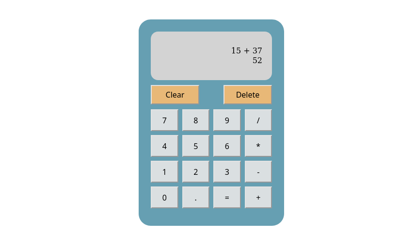

### Calculator 

---

View the project live [here](https://brenton-j-andrews.github.io/Calculator/).

---

#### About this project

Completed for [The Odin Project](https://www.theodinproject.com/lessons/foundations-calculator) Fundamentals course.

This application is a simple calculator that can perform basic calculation, it was created with vanilla JavaScript, HTML and CSS. Nice and simple!
